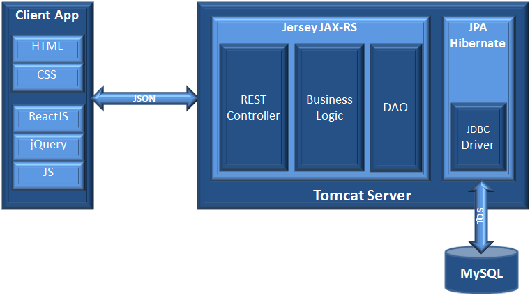
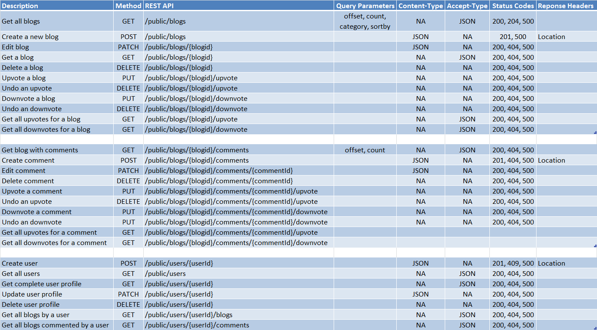
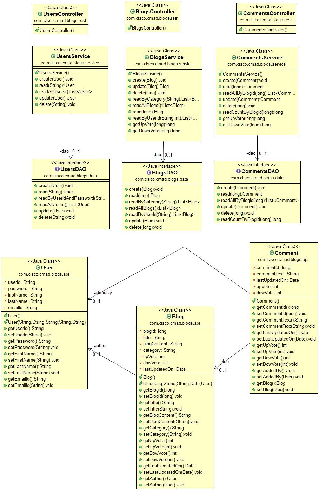
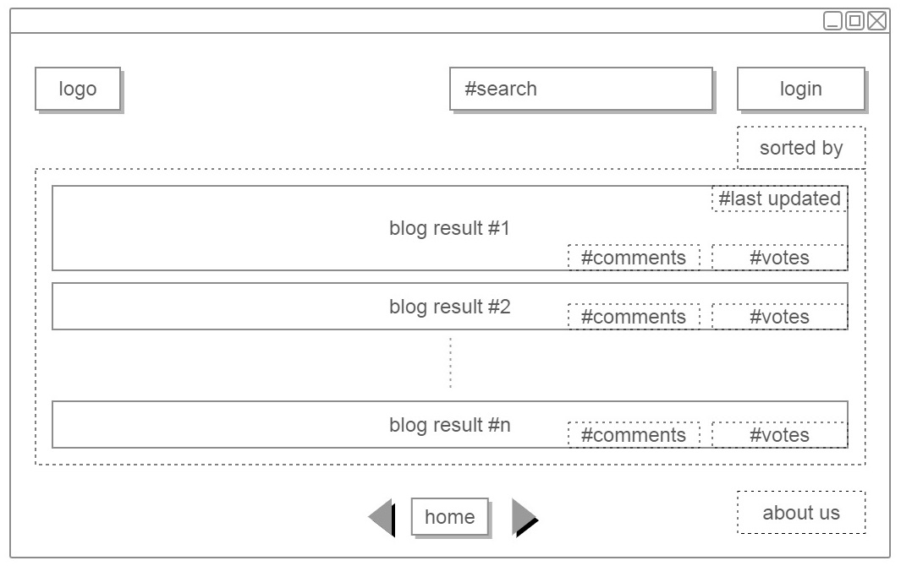
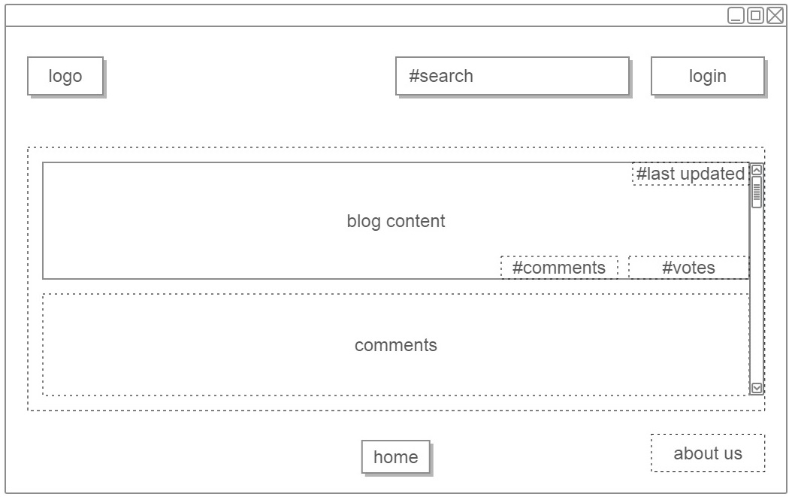
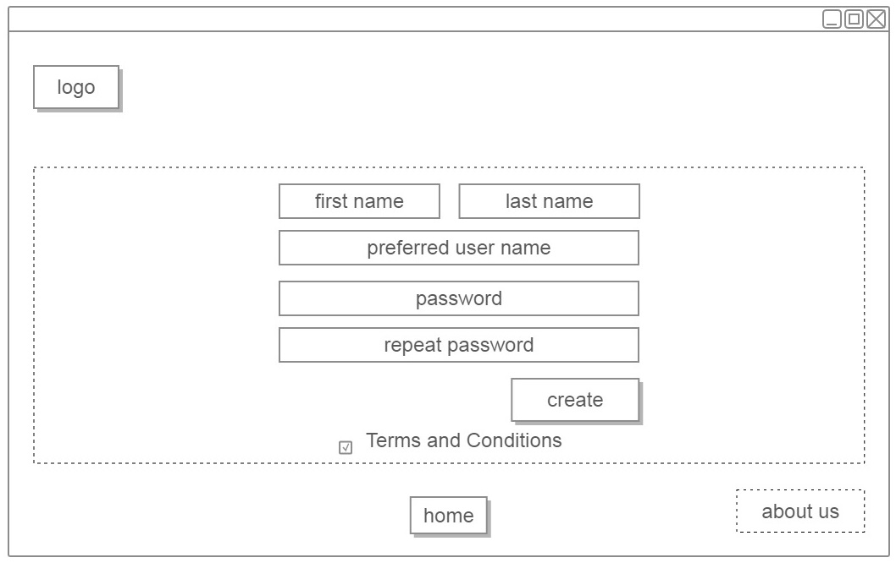
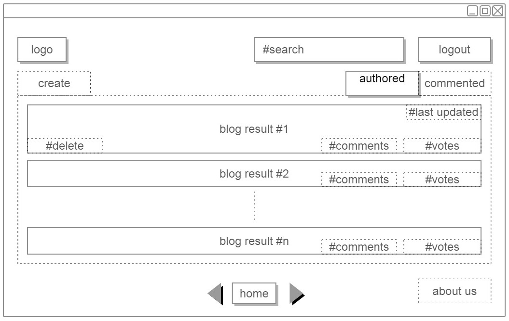
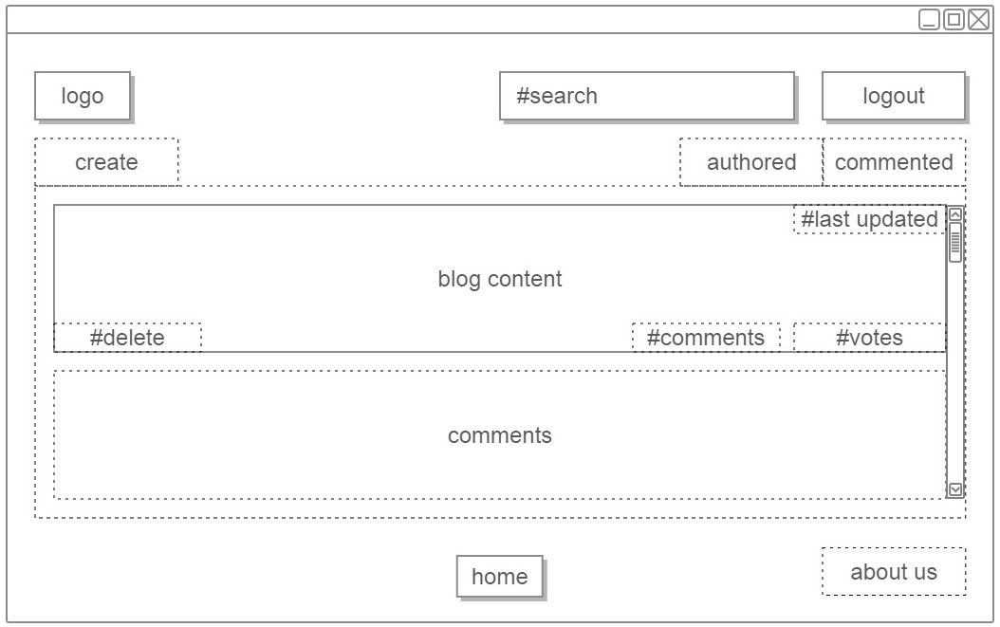

# CMAD Cohert V - Simple Blogging Site

## High Level Architecture

## REST documentation

## Class Design

## UI mock flow
### Home Page

### Read Blog without logging in 

### Login screen

### Create user

### Logged in - Blogs sorted by authored

### Logged in - Blogs sorted by commented

### Logged in - Create Blog

### Logged in - Saved Blog
